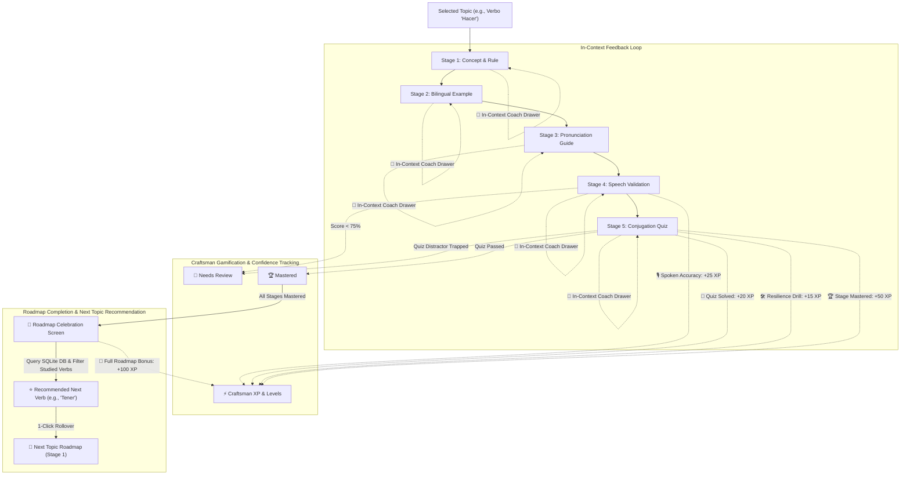

# 🎓 LingoCraft AI — Foreign Language Learning Coach

**LingoCraft AI** is an interactive, empathetic, and research-backed language learning coach built with **Google ADK (Agent Development Kit)**, **Google GenAI (Gemini 2.5)**, and **Streamlit**.

Guided by evidence-based language acquisition principles, LingoCraft AI guides learners through topic-focused, tense-by-tense mastery using an enhanced **5-stage active recall flashcard system**, **word-level pronunciation diffs**, **in-context coach assistance**, and a **pedagogy-first Craftsman XP gamification engine**.

---

## 🌟 Architecture & Pedagogical Flow



---

## ✨ Core Features & Enhancements

### 1. 5-Stage Active Recall Flashcard System
Each grammatical form (e.g., *Infinitivo*, *Gerundio*, *Participio*, *Presente*, *Pretérito*) is delivered through 5 sequential, focused learning cards:
- **Card 1: Concept & Rule:** Clear grammatical principles, usage contexts, and trigger keywords.
- **Card 2: Bilingual Example:** High-utility comparative sentences contrasting the target language against the student's native tongue (supports **English**, **Portuguese**, and **Spanish**).
- **Card 3: Pronunciation Guide:** Syllabic breakdown with stressed syllables capitalized (e.g., *ha-**CIEN**-do*), phonetic tips, and audio playback.
- **Card 4: Speech Validation:** Voice recording via microphone with transcription, accuracy scoring, and phoneme guidance.
- **Card 5: Conjugation Quiz:** Contextual multiple-choice challenges explaining distractor pitfalls and providing immediate micro-drills upon error.

---

### 2. Dual-Speed Audio Playback (`Normal 1.0x` vs `Practice Pace 0.75x`)
- Listen to pronunciation guides (Card 3) and full bilingual comparative sentences (Card 2) at natural conversational tempo or slowed training cadence.
- Built-in zero-latency in-memory audio caching (`@functools.lru_cache`) guarantees instantaneous (<0.00001s) audio playback.

---

### 3. Word-Level Visual Diff on Speech Validation
- Color-coded tactile chips display speech accuracy after vocal exercises:
  - `diff-match` (Green chip `✓`): Accurate vocalization.
  - `diff-near` (Amber chip `≈`): Minor vowel/accent variation.
  - `diff-miss` (Red wavy chip `⚠️`): Mispronounced or substituted token.
  - `diff-omitted` (Dashed chip `❌`): Skipped or omitted word.
  - Detects extra spoken tokens and offers targeted articulatory tips.

---

### 4. In-Context Coach Consultation Drawer
- Available directly inside all 5 cards without switching tabs or losing study momentum.
- Pre-populates intelligent quick-question pills tailored to the active tense and grammatical nuances.
- Allows asking custom questions directly to Coach LingoCraft; responses synchronize seamlessly with the main Coach Chat history.

---

### 5. 3-Tier Spaced Repetition & Confidence Tracking
- **🏆 Mastered:** Forms verified through successful quizzes or explicitly marked complete.
- **🔄 Needs Review:** Automatically flagged when speech accuracy is below 75%, when quiz errors occur, or when manually tagged for spaced repetition.
- **🎯 In Progress / ⏳ Upcoming:** Active and pending roadmap items clearly tracked in the sidebar and Curriculum Overview tab.

---

### 6. Pedagogy-First Gamification & Craftsman XP Points
- **Meaningful Learning Actions:**
  - **🎙️ Speech Vocalization & Accuracy:** `+10 XP` to `+25 XP`
  - **🎯 Correct Conjugation Quiz:** `+20 XP`
  - **🛠️ Resilience Micro-Practice Drill:** `+15 XP`
  - **🏆 Stage Mastery:** `+50 XP`
  - **🌟 Full Roadmap Completion:** `+100 XP`
- **Craftsman Rank Progression:**
  - **Level 1: Novice Explorer** (0 – 100 XP)
  - **Level 2: Apprentice Speaker** (101 – 250 XP)
  - **Level 3: Confident Conversationalist** (251 – 500 XP)
  - **Level 4: Master Craftsman** (500+ XP)
- Idempotent tracking prevents gaming points, while lightweight celebratory toasts provide positive reinforcement.

---

### 7. Next Topic Recommendation Engine for Completed Roadmaps
- **Celebratory Achievement Screen:** Acknowledges full roadmap mastery with balloons, total XP summary, and rank badge.
- **Unstudied Topic Filtering:** Analyzes previous sessions stored in SQLite to recommend common irregular verbs and topics not yet studied.
- **High-Frequency Catalog:** Covers foundational verbs and grammatical pairs for Spanish (*tener, ir, ser vs estar, poner, decir, poder, querer, saber, venir, pretérito vs imperfecto*), Portuguese (*ter, ir, ser vs estar, pôr, dizer, poder, vir, perfeito vs imperfeito*), and English (*to be, to have, to go, to see, to take*).
- **1-Click Rollover:** Awards a **+100 XP** completion bonus, loads the new curriculum, resets stage progress to Stage 1, preserves accumulated XP and chat history, and auto-saves to SQLite.
- **Discovery Options:** Includes alternative unstudied verbs, a `[🎲 Shuffle recommendations]` button, and a custom topic popover.

---

### 8. Pre-Curated Offline Mastery Packs
- **Zero API Key Required:** Rich offline packs for Spanish **"Hacer"** and **"Tener"** allow immediate practice right out of the box.
- Fully localized in **English** and **Portuguese** native support modes.
- Enter a Gemini API Key anytime in the sidebar to generate dynamic curricula for any global language or grammatical topic.

---

### 9. State Persistence & Deep Linking
- **SQLite Database:** Automatically persists active topic, tense progress, card step, completed tenses, review flags, chat history, and XP points.
- **Session Codes:** Resume any study session with 6-character session codes (e.g., `lingo-abc123`).
- **Deep Linking:** Synchronizes active state with URL parameters (`?sid=...&tab=...&tense=...&step=...`).
- **Browser Resilience:** Caches active session IDs in `localStorage` to recover progress seamlessly across browser restarts.

---

### 10. Observability & Visual Element (VE) Telemetry
- Built following Google Frontend Telemetry standards.
- Tracks interaction events (`tab_learn_view`, `audio_play`, `quiz_submit`, `speech_validated`, `next_topic_started`, `xp_awarded`) viewable in the sidebar telemetry expander.

---

## 🏛️ Multi-Agent Architecture (Google ADK)

LingoCraft AI coordinates specialized pedagogical agents built on the Google Agent Development Kit (ADK):

| Agent | Location | Primary Responsibility |
|---|---|---|
| **Curriculum Agent** | [`skills/curriculum_agent.py`](file:///usr/local/google/home/gilsonsoares/LingoCraft_ai/skills/curriculum_agent.py) | Formulates pedagogical tense roadmaps for target languages. |
| **Flashcard Agent** | [`skills/flashcard_agent.py`](file:///usr/local/google/home/gilsonsoares/LingoCraft_ai/skills/flashcard_agent.py) | Generates structured 5-stage card packs (Concept, Example, Pronunciation, Speech, Quiz). |
| **Speech Validation Agent** | [`skills/speech_agent.py`](file:///usr/local/google/home/gilsonsoares/LingoCraft_ai/skills/speech_agent.py) | Analyzes spoken phonetics, scores accuracy, and outputs word-level diffs. |
| **Conjugation Quiz Evaluator** | [`skills/quiz_agent.py`](file:///usr/local/google/home/gilsonsoares/LingoCraft_ai/skills/quiz_agent.py) | Assesses quiz answers, details distractor explanations, and generates micro-drills. |
| **Coach Chat Agent** | [`skills/coach_chat_agent.py`](file:///usr/local/google/home/gilsonsoares/LingoCraft_ai/skills/coach_chat_agent.py) | Empathetic coach answering contextual learner inquiries in real time. |

---

## 🚀 Quickstart & Setup

### 1. Prerequisites
- Python 3.10+ (tested on Python 3.11 & 3.13)
- Modern web browser (Chrome, Edge, Firefox, Safari)

### 2. Installation
```bash
# Clone or navigate to the repository
cd LingoCraft_ai

# Create and activate virtual environment
python3 -m venv .venv
source .venv/bin/activate

# Install dependencies
pip install -r requirements.txt
```

### 3. Configure Environment (Optional)
```bash
cp .env.example .env
# Edit .env and insert GEMINI_API_KEY=your_key_here
```
*(Note: LingoCraft AI includes offline mastery packs for instant practice without an API key!)*

### 4. Run the Application
```bash
# Start Streamlit application
streamlit run app.py --server.port 8501
```
Access the application at `http://localhost:8501` (or your cloudtop proxy URL `http://<hostname>:8501`).

---

## 🧪 Automated Test Suite

Run the full end-to-end unit and integration test suite:

```bash
python test_lingocraft.py
```

The test suite validates all 12 core subsystems:
1. `[1]` Native Language Localization (English vs Portuguese)
2. `[2]` Flashcard Pack & Suggested Coach Prompts
3. `[3]` Bilingual Comparative Phrase Structure
4. `[4]` Conjugation Quiz Evaluator & Distractor Explanations
5. `[5]` Empathetic Coach Chat Localization
6. `[6]` Zero-Latency TTS Audio Caching
7. `[7]` SQLite Session Manager Persistence & Schema Migrations
8. `[8]` Dual-Speed TTS Audio Playback (1.0x vs 0.75x)
9. `[9]` Word-Level Visual Diff & Chip Generation
10. `[10]` 3-Tier Mastery & Needs Review State Tracking
11. `[11]` Craftsman Gamification & XP Points System
12. `[12]` Next Topic Recommendation Engine & Unstudied Filtering

---

## 📂 Project Structure

```
LingoCraft_ai/
├── app.py                      # Main Streamlit application (Material 3 UI, Stepper, Audio, XP)
├── curriculum_data.py          # Data models, curated offline courses (Hacer, Tener), common topics catalog
├── session_manager.py          # SQLite persistence, session recovery, XP ranks, studied topic tracking
├── lingocraft_agent.py         # Google ADK Orchestrator coordinating all learning skills
├── audio_utils.py              # Zero-latency TTS audio generation, dual-speed, speech diff analysis
├── test_lingocraft.py          # Comprehensive 12-suite unit and integration test runner
├── requirements.txt            # Python dependencies
├── skills/
│   ├── curriculum_agent.py     # Roadmap formulation agent
│   ├── flashcard_agent.py      # 5-stage card generator agent
│   ├── speech_agent.py         # Audio validation and phonetic scoring agent
│   ├── quiz_agent.py           # Quiz evaluator and micro-practice generator agent
│   └── coach_chat_agent.py     # Contextual empathetic coach agent
└── lingocraft_study.db         # Local SQLite session database (auto-created on first run)
```

